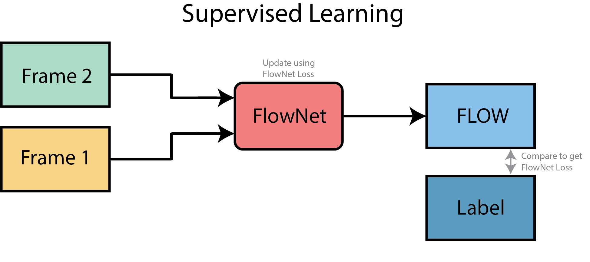
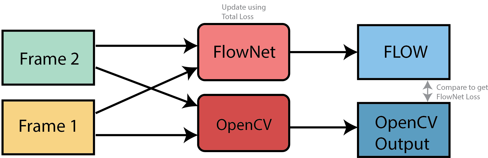

# Unsupervised Optical Flow Estimation
###### This repository is the result of an honors academy project done by Lucian Radulescu and Jake Rap under supervision of Fabrizio Piva and Daan de Geus at Eindhoven University of Technology (TU/e).

## Problem Definition

what is optical flow?

why want it?

what is unsupervised?

why want it?

## Project Preparation

initial knowledge on DL

how we got familiar with AI

image class

semantic class

include global planning

## Methods

### Supervised Optical Flow

### Unsupervised Aproach 1:
> using opencv

### unsupervised apraoch 2: with GANs

## Results

## Conclusion
