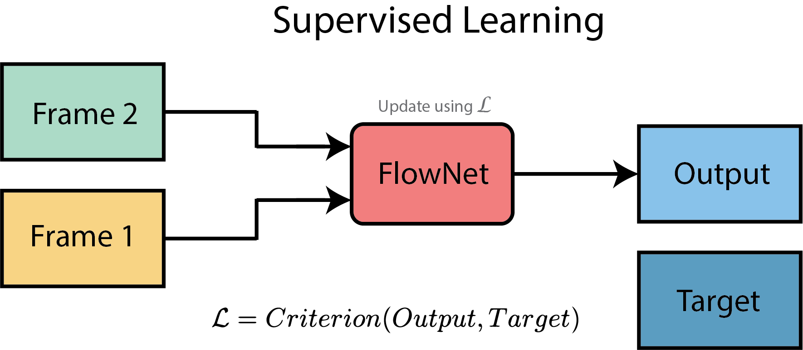
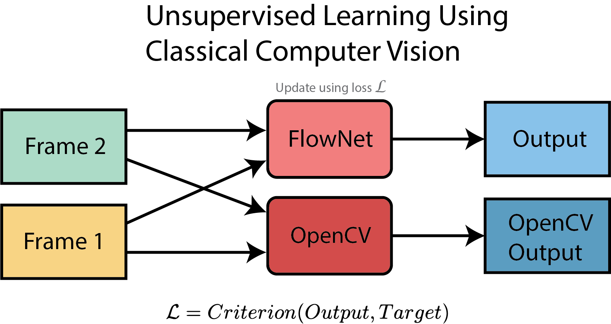
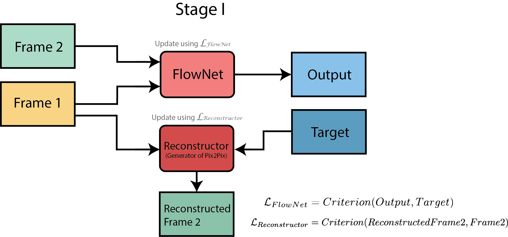
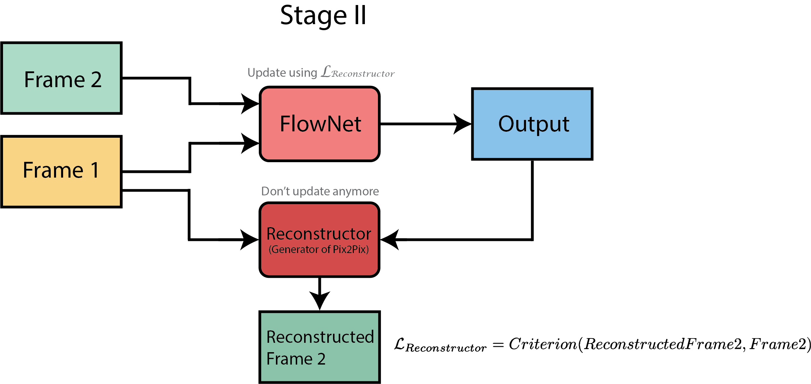

# Unsupervised Optical Flow Estimation
###### This repository is the result of an honors academy project done by Lucian Radulescu and Jake Rap under supervision of Fabrizio Piva and Daan de Geus at Eindhoven University of Technology (TU/e).

# Problem Definition

what is optical flow?

why want it?

what is unsupervised?

why want it?

# Project Preparation

initial knowledge on DL

how we got familiar with the fudamentals of DL
[CS231n: Convolutional Neural Networks for Visual Recognition](https://www.youtube.com/watch?v=vT1JzLTH4G4&list=PL3FW7Lu3i5JvHM8ljYj-zLfQRF3EO8sYv)

image class

[VGG: Very Deep Convolutional Networks for Large-Scale Image Recognition](https://arxiv.org/abs/1409.1556)

[ResNet: Deep Residual Learning for Image Recognition](https://arxiv.org/abs/1512.03385)

semantic seg

[DeepLabV2: Semantic Image Segmentation with Deep Convolutional Nets, Atrous Convolution, and Fully Connected CRFs](https://arxiv.org/abs/1706.05587)

[FCN: Fully Convolutional Networks for Semantic Segmentation](https://arxiv.org/abs/1411.4038)

include global planning

# Methods

[FlowNet](https://arxiv.org/abs/1504.06852)

## Supervised Optical Flow

text

text

text

text

text

## Unsupervised Aproach 1: with classical computer vision

text

text

text

text

text

## unsupervised Aproach 2: with a GAN

[Pix2Pix](https://arxiv.org/abs/1611.07004)

text

text

text

text

text

text

text

text

# Results

text

text

# Conclusion

text

text

## Acknowledgemnets

(repos where we got most of our code)

